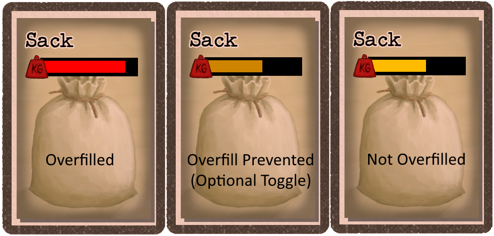

# Show Container Overfill
Changes the weight bar to red if a container is holding more than the weight bonus.  For example, Sacks and Travois both can carry more than the weight they can offset.


# Installation 
This section describes how to manually install the mod.

**If using the Vortex mod manager from NexusMods, these steps are not needed.**

## Overview
This mod requires the BepInEx mod loader.

## BepInEx Setup
If BepInEx has already been installed, skip this section.

Download BepInEx from https://github.com/BepInEx/BepInEx/releases/download/v5.4.21/BepInEx_x64_5.4.21.0.zip

* Extract the contents of the BepInEx zip file into the game's directory:
```<Steam Directory>\steamapps\common\Card Survival Tropical Island```

    __Important__:  The .zip file *must* be extracted to the root folder of the game.  If BepInEx was extracted correctly, the following directory will exist: ```<Steam Directory>\steamapps\common\Card Survival Tropical Island\BepInEx```.  This is a common install issue.

* Run the game.  Once the main menu is shown, exit the game.
    
* In the BepInEx folder, there will now be a "plugins" directory.

## Mod Setup
* Download the ShowContainerOverfill.zip.  
    * If on Nexumods.com, download from the Files tab.
    * Otherwise, download from https://github.com/NBKRedSpy/CardSurvival-ShowContainerOverfill/releases/

* Extract the contents of the zip file into the ```BepInEx/plugins``` folder.

* Run the Game.  The mod will now be enabled.

# Uninstalling

## Uninstall
This resets the game to an unmodded state.

Delete the BepInEx folder from the game's directory
```<Steam Directory>\steamapps\common\Card Survival Tropical Island\BepInEx```

## Uninstalling This Mod Only

This method removes this mod, but keeps the BepInEx mod loader and any other mods.

Delete the ```ShowContainerOverfill.dll``` from the ```<Steam Directory>\steamapps\common\Card Survival Tropical Island\BepInEx\plugins``` directory.

# Compatibility
Safe to add and remove from existing saves.

# Change Log 

## 1.0.0  
* Initial Release


